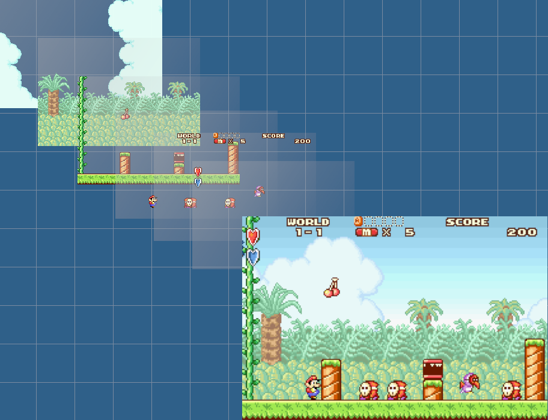

# PPU
## The Hardware
The Pixel Processing Unit (PPU) is a separate hardware unit connected to the CPU via a bus. Controlling the PPU is entirely done through memory mapped registers and memory mapped video memory. As a lot of games rely on exact timings and behaviours of the PPU it was pretty much impossible to implement rendering in a more modern and (on today's systems) performant way. That's why our implementation resembles the original quiet closely.
The PPU internally manages 1 to 4 background layers and up to 128 sprites. The order of these sprites and background layers can be changed.

The PPU (generally, there are exceptions) picks the first pixel from top to bottom which is not transparent and displays it. 

## Our Implementation
There are two main methods of rendering: `Legacy` and `frame-wise`. The first one is more truthful to how it's done on hardware. The second one is explained below as it yields better performance:
The CPU executes 960 instructions. Then `LCDController::drawScanline()` are `LCDController::onHBlank()` are called. Then another 272 instructions are executed. This is done to match the timings on the original hardware. This is done 160 times, once for each visible on-screen scanline. After that the LCD is in the v-blanking-stage which is emulated with a call to `LCDController::onVBlank()`. In that time the image is pushed to the screen (SDL2 or frame buffer in embedded devices).
The rendering magic happens in `Renderer::drawScanline()` which is called by LCDController:
First all properties needed for rendering are loaded. This includes but is not limited to
- Setting up the properties of all background layers such as size, offset, scale, video data location and much more.
- Constructing all sprites with properties such as size, offset, transformation and much more. In addition the sprites are split up on four separate layers.
- Loading additional information about post color effects, alpha blending, windowing and more. Then the scanline for each background and sprite layer is rendered. As we now have at most 8 separate scanlines the `Renderer` just has to blend those pixel by pixel (or pick the top one if no blending is activated). Rendering all layers seperately and then merging them together turns out to be the most performant solution as it is more cache and branch friendly. Note that this is just a very high-level coarse description of what is actually happening.